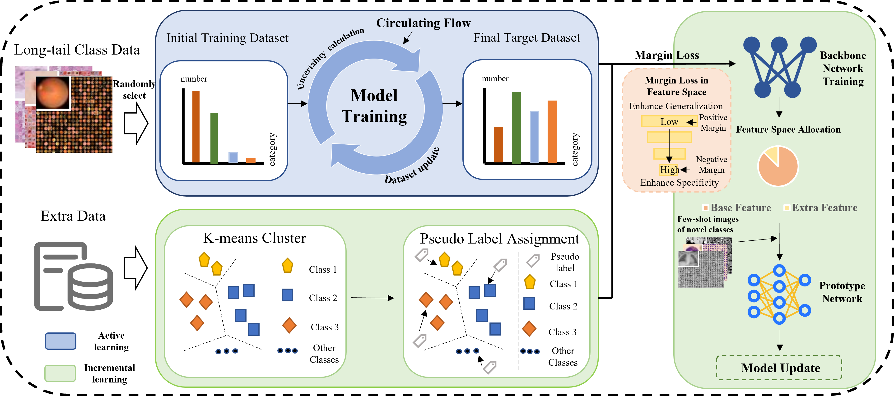

# FSCIL-Med

This work formulates the problem with long-tailed base classes and proposes a two-stage unified framework, achieving outstanding performance on the MedMNIST dataset.  
**The code will be updated soon.**

---

## 📌 Overview

---

## ✨ Features
- **Two-stage unified framework** for few-shot class-incremental learning.
- Designed for **long-tailed medical imaging datasets**.
- Achieves **outstanding performance** on the MedMNIST dataset.

---

## 📊 Results
You can insert charts or performance comparison figures here.

**Table:** Test accuracy (%) for each incremental session on MedMNIST-I and MedMNIST-II.  
*AD* denotes the accuracy degradation relative to session 0, and *Acc_avg* is the mean accuracy across all sessions.

| Dataset     | Method   | 0       | 1       | 2       | 3       | 4       | 5       | 6       | AD ↓   | Acc_avg |
|-------------|----------|---------|---------|---------|---------|---------|---------|---------|--------|---------|
| **MedMNIST-I** | Baseline | 80.44   | 70.50   | 64.15   | 58.03   | 53.35   | 51.59   | 47.48   | 32.96  | 60.79   |
|             | FACT     | **80.69** | 70.56   | 65.27   | 58.82   | 54.17   | 52.07   | 47.95   | 32.74  | 61.36   |
|             | Ours     | 80.26   | **71.52** | **66.36** | **59.91** | **54.85** | **53.06** | **48.93** | **31.33** | **62.13** |
| **MedMNIST-II** | Baseline | 65.87   | 61.81   | 56.75   | 51.30   | 49.63   | 45.52   | 42.93   | 22.94  | 53.40   |
|             | FACT     | 66.16   | **62.63** | 57.11   | 52.56   | 51.29   | 48.30   | 45.75   | 20.41  | 54.83   |
|             | Ours     | **67.12** | 62.41   | **58.25** | **53.43** | **51.91** | **49.74** | **46.99** | **20.13** | **55.69** |

---

